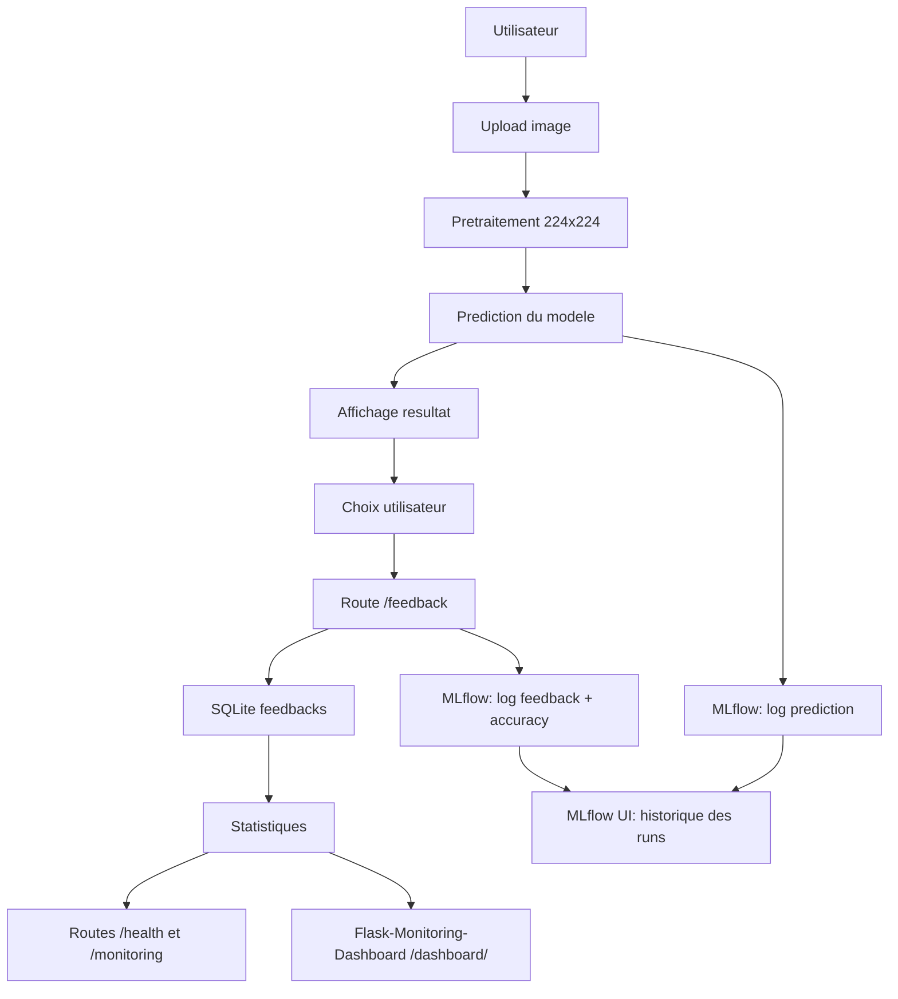

# Appendice B - Schema et logique de la feedback loop SQLite

Cet appendice doit etre lu avec le rapport principal. Il approfondit la logique de stockage de la feedback loop.

## Diagramme de flux

## Champs sauvegardes

La table `feedbacks` contient :

1. `image_filename` ;
2. `image_data_url` ;
3. `predicted_label` ;
4. `user_label` ;
5. `confidence_score` ;
6. `timestamp` ;
7. `is_correct` ;
8. `model_version`.

## Usage metier

Ces donnees peuvent ensuite servir a :

1. mesurer la qualite percue du modele ;
2. detecter une classe plus souvent corrigee que les autres ;
3. preparer un futur jeu de reentrainement supervise ;
4. prioriser les corrections du pipeline de donnees.

## Limite connue

Le stockage de l'image complete sous forme de Data URL est acceptable pour une maquette locale, mais ne constitue pas une cible de production. En production, il faudrait preferer un stockage objet avec referencement par identifiant.