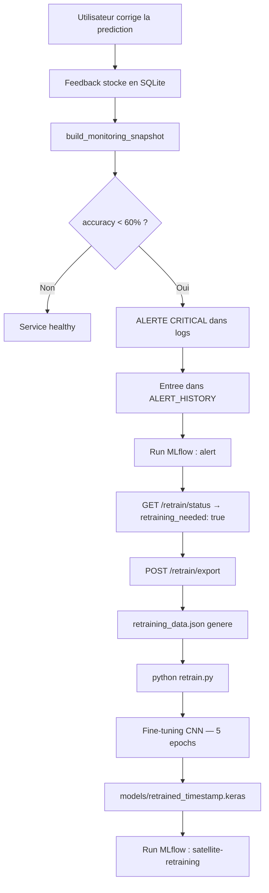

# Appendice E — Boucle de réentraînement (circuit complet)

Cet appendice doit être lu avec le rapport principal (section 4.5).
Il documente le circuit complet de réentraînement basé sur les feedbacks utilisateur.

## Principe

Lorsque l'accuracy du modèle chute en dessous du seuil critique (60 %),
le dispositif de monitoring déclenche des alertes. La boucle de réentraînement
permet à l'opérateur de capitaliser sur les corrections des utilisateurs
pour améliorer le modèle.

## Diagramme du circuit



## Endpoints exposés

### `GET /retrain/status`

Indique si un réentraînement est recommandé.

Exemple de réponse (accuracy trop basse) :
```json
{
  "retraining_needed": true,
  "reason": "accuracy 40.0% en dessous du seuil critique 60.0%",
  "feedback_count": 12,
  "accuracy": 40.0,
  "min_feedbacks_required": 10,
  "export_endpoint": "/retrain/export"
}
```

### `POST /retrain/export`

Déclenche l'export des feedbacks vers `retraining_data.json`
et enregistre un run MLflow de type `retrain_trigger`.

Exemple de réponse :
```json
{
  "exported": true,
  "export_path": "/chemin/vers/app/retraining_data.json",
  "feedback_count": 12,
  "accuracy": 40.0,
  "next_step": "Lancer 'python retrain.py' pour fine-tuner le modele."
}
```

### `GET /alerts`

Retourne l'historique des alertes emises depuis le dernier démarrage.

```json
{
  "alerts": [
    {
      "timestamp": "2026-03-18T14:23:01",
      "level": "critical",
      "accuracy": 40.0,
      "feedback_count": 12,
      "message": "Accuracy 40.0% en dessous du seuil 60.0%"
    }
  ],
  "count": 1
}
```

## Script `retrain.py`

Ce script autonome réalise le fine-tuning du CNN à partir des données
exportées. Il peut être lancé manuellement ou intégré dans un pipeline CI.

### Paramètres

| Paramètre | Description | Défaut |
|-----------|-------------|--------|
| `--min-feedback` | Nombre minimum de feedbacks requis | `10` |
| `--output` | Chemin du modèle sauvegardé | `models/retrained_<timestamp>.keras` |

### Stratégie de fine-tuning

1. Gel de toutes les couches sauf les 4 dernières (extraction de features préservée).
2. Compilation avec Adam `lr=1e-4` (taux d'apprentissage faible pour éviter le catastrophic forgetting).
3. Entraînement sur 5 epochs avec validation split 20 %.
4. Sauvegarde en `.keras` avec horodatage pour versionner les modèles.
5. Log dans MLflow (expérience `satellite-retraining`) : paramètres, accuracy finale, chemin du modèle.

### Exemple d'utilisation

```powershell
# Depuis le dossier app/
python retrain.py --min-feedback 10
# → models/retrained_20260318_142301.keras
# → Run MLflow visible dans http://127.0.0.1:5001 (expérience satellite-retraining)
```

## Format du fichier d'export (`retraining_data.json`)

```json
[
  {
    "image_data_url": "data:image/jpeg;base64,...",
    "true_label": "forest",
    "predicted_label": "meadow",
    "confidence": 0.72,
    "timestamp": "2026-03-18T14:20:00"
  }
]
```

Le champ `true_label` correspond au label corrigé par l'utilisateur,
qui constitue la vérité terrain pour le réentraînement.

## Limitations et perspectives

| Limitation | Explication |
|-----------|-------------|
| Persistance volatile | `ALERT_HISTORY` est en mémoire : une relance de l'application efface l'historique. En production, persister dans SQLite ou un fichier JSON. |
| Fine-tuning local | `retrain.py` tourne en local sur CPU/GPU. En production, déléguer à un job Kubernetes ou un pipeline MLflow Projects. |
| Données limitées | Le fine-tuning sur peu d'exemples peut provoquer un surapprentissage. Augmenter le dataset ou ajuster les hyperparamètres. |
| Validation humaine | Le modèle réentraîné n'est pas automatiquement déployé. Une validation manuelle est nécessaire avant de remplacer `final_cnn.keras`. |
